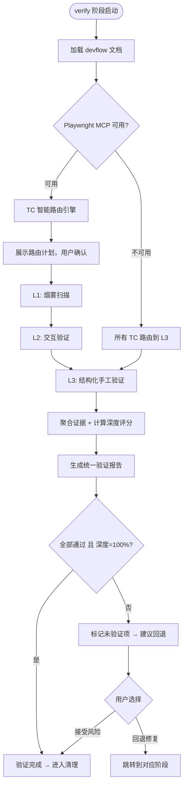
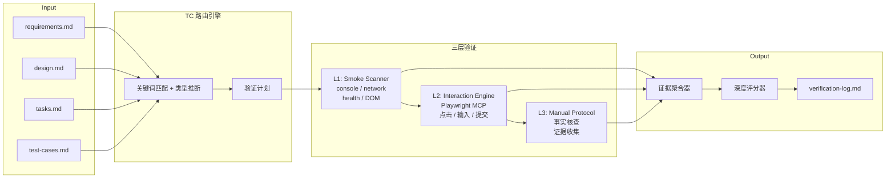

# 设计规格

> 生成时间: 2026-06-09
> 来源: /devflow — 方案蓝图阶段
> 基于: devflow/requirements.md

## 业务流程

## 技术架构（数据流）

## 范围与边界

### 在范围内
- L1 烟雾扫描：保留现有 4 类检查（console error / network health / runtime health / DOM snapshot），措辞微调
- L2 交互验证：使用 Playwright MCP 执行真实用户操作（点击、输入、提交），记录 DOM 前后状态
- L3 结构化手工验证：证据驱动的 TC 逐条核对，无证据不标记完成
- TC 智能路由：关键词 + 类型匹配，将 TC 自动分发到三层
- 验证深度评分：执行率 + 证据覆盖率 + 分层覆盖分布
- 统一报告格式：单份 `verification-log.md` 包含全部三层结果
- Playwright 降级：不可用时全部路由到 L3，保持流程完整性
- 纯文本证据链：DOM snapshot / console log / network log / interaction trace，零截图零录像

### 明确排除
- 截图与录像（无调试价值、占用磁盘空间）
- L2 的自动化断言（如 assert text equals、assert element visible）——只做 DOM 变化检测，不做精确断言
- 多浏览器并行扫描
- 性能/Lighthouse 测试
- 视觉回归测试
- 邮件/短信/第三方回调等外部依赖的自动验证

## 设计决策

| 决策 | 理由 | 考虑的替代方案 |
|------|------|---------------|
| 三层递进而非大一统 | L1 快（秒级）、L2 真交互（分钟级）、L3 人工判断，各司其职 | 全部自动化（假阳性高）、全部手工（太慢） |
| L2 不做精确断言，只做 DOM diff | 避免依赖具体文案，提高通用性 | 精确文本断言（跨页面脆弱，文案变化就误报） |
| 纯文本证据，零截图零录像 | 截图难定位根因；录像不可行且占空间；文本能提供全部调试信息 | 截图 on fail（用户反馈无调试价值） |
| 证据驱动：无证据=未验证 | 防止"走过场"——不能口头说通过 | 信任模型判断（虚假通过风险高） |
| 深度评分暴露验证质量 | 让用户一眼看到验证是否充分，而非仅有通过率 | 仅看 pass/fail（掩盖验证不充分的问题） |
| TC 路由可人工调整 | 模型判断可能不准，用户应有最终决定权 | 全自动路由（路由错误无法纠正） |

## 风险与缓解

| 风险 | 影响 | 缓解措施 |
|------|------|---------|
| Playwright MCP 不可用 | L2 全部降级到 L3，交互验证需要人工执行 | 降级时明确提示，结构化引导用户手动操作并报告结果 |
| L2 自动操作触发副作用（如真实发送邮件、扣款） | 生产数据污染 | 验证前检查 baseURL（非 localhost 时警告），TC 步骤中标注"有副作用"的跳过自动执行 |
| DOM diff 噪声大（动态 ID、时间戳） | 无法准确判断操作是否生效 | 取 DOM 结构的语义标签（button、input、nav、form 等）而非属性值做 diff |
| 复杂交互链条过长导致超时 | L2 卡住 | 单条 TC 最长操作 5 步，超过则拆分；单步超时 30s |
| 用户跳过 L3 证据收集 | 验证报告证据覆盖率低 | 深度 < 100% 时报告顶部红色警告；跳过 TC 必须给原因 |

## TC 路由规则（参考实现）

以下规则用于 TC 智能路由引擎 (R-004)，在此定义供实现引用：

### 关键词 → 层级映射

| TC 内容含以下关键词 | 路由到 | 原因 |
|---------------------|--------|------|
| 不报错、控制台错误、网络请求、HTTP 状态、页面加载、资源加载、白屏、崩溃 | L1 | 静态健康检查可覆盖 |
| 点击、输入、填写、提交、选择、上传、删除、编辑、创建、搜索、登录、注册、跳转、导航 | L2 | 需要真实交互 |
| 权限、角色、动画、过渡、响应式、文案、样式、颜色、布局、流畅、视觉 | L3 | 需要人的主观判断 |

### TC 类型 → 默认层级

| TC 类型字段 | 默认层级 | 说明 |
|-------------|----------|------|
| 单元 | L1 | 代码级测试，检查错误输出即可 |
| 集成 | L1 或 L2 | 视关键词而定 |
| 端到端 | L2 | 模拟用户操作链路 |
| 手工 | L3 | 需要人工判断 |

### 路由优先级

1. 如果 TC 类型为"端到端" 且内容含交互关键词 → L2
2. 如果 TC 类型为"手工" 且内容含主观判断关键词 → L3
3. 如果 TC 内容含 L1 关键词但不含 L2/L3 关键词 → L1
4. 默认 → L3（宁可手工验证，不冒假阳性风险）

---

*由 DevFlow 追踪。请勿手动编辑。*
