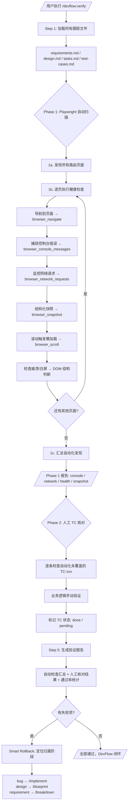

# Design Specification

> Generated: 2026-06-02
> Source: /devflow:blueprint
> Based on: devflow/requirements.md

## Business Process Flow

升级后 verify 的两阶段验证管道：

## Scope & Boundaries

### In Scope
- 仅修改 `skills/verify/SKILL.md` 文件
- Phase 1 四项自动化检查：控制台错误、网络请求、运行时健康、DOM 快照
- Phase 2 保留原有人工核对流程
- 增强验证报告，汇总自动+人工结果
- 使用 Playwright MCP 已有工具（browser_console_messages, browser_network_requests, browser_snapshot, browser_navigate, browser_scroll）

### Out of Scope (Non-Goals)
- 不引入新的 MCP Server 或插件
- 不依赖多模态 / 视觉模型（不做视觉回归测试）
- 不修改其他 5 个 skill（clarify/breakdown/blueprint/implement/discover）
- 不做性能测试（Lighthouse / Core Web Vitals）
- 不做无障碍合规审计（WCAG）
- 不做跨浏览器兼容性测试
- 不写 Playwright 测试脚本文件（.spec.ts）— 通过 MCP 工具实时执行

## Technical Standards

- **Skill 格式:** YAML frontmatter + Markdown body，遵循 Claude Code Plugin 规范
- **allowed-tools 更新:** 新增 Playwright MCP 工具：`browser_navigate`, `browser_console_messages`, `browser_network_requests`, `browser_snapshot`, `browser_scroll`, `browser_take_screenshot`（可选用于调试）
- **代码质量:** 按 DevFlow Production-Grade Baseline 标准，skill 中的指令必须完整覆盖错误处理、边界条件
- **兼容性:** 不依赖特定模型的多模态能力，所有检查基于结构化数据（控制台文本、HTTP 状态码、DOM 语义结构）

## Design Decisions

| Decision | Rationale | Alternatives Considered |
|----------|-----------|------------------------|
| 两阶段管道（自动→人工）而非全自动 | 业务逻辑验证仍需要人工判断；自动化覆盖结构性缺陷 | 全自动 Playwright 脚本：假阳性率高，业务逻辑无法验证 |
| 使用 Playwright MCP 工具而非写 .spec.ts 文件 | MCP 工具实时执行，无需项目配置；skill 自包含更简洁 | 生成 Playwright 测试文件：需要项目集成，用户需要额外配置 |
| browser_snapshot 替代多模态视觉 | 结构化语义数据无需视觉模型即可验证 UI 结构 | 视觉回归测试 (toHaveScreenshot)：需要视觉模型，受模型限制 |
| console.error 零容忍 + allowlist | 零假阴性是底线，但已知无害错误（favicon 404 等）应允许豁免 | 仅报告不标记失败：AI 容易忽略警告 |
| 按类别分组报告而非扁平列表 | 便于定位问题根因（网络层 vs UI 层 vs 业务层） | 扁平 TC 列表：信息丢失，难以诊断 |

## Risks & Mitigations

| Risk | Impact | Mitigation |
|------|--------|------------|
| Playwright MCP 不可用或未启动 | Phase 1 完全无法执行 | Step 1 检查 MCP 可用性，不可用时降级为全人工模式并提示用户 |
| 路由发现不完整 | 遗漏页面未检查 | 询问用户确认路由列表；支持手动补充 URL |
| console.error allowlist 过于宽松 | 真实错误被豁免 | allowlist 默认仅包含 favicon.ico 404 和 source map 404，其他需用户显式确认 |
| browser_snapshot 断言脆弱（UI 微调导致假阳性） | 误报过多降低信任 | 使用存在性断言（元素是否存在）而非精确文本匹配；不检查 CSS 样式细节 |
| DeepSeek V4 Pro 工具调用延迟 | 大量页面扫描耗时长 | 设置每页超时（15s），超时页面记录为警告而非失败 |

---
*Tracked by DevFlow. Do not edit manually.*
