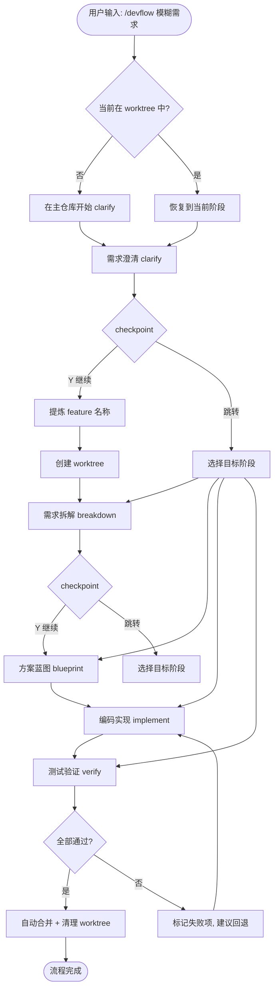

# 设计规格

> 生成时间: 2026-06-09
> 来源: /devflow:blueprint
> 基于: devflow/requirements.md

## 业务流程

## 范围与边界

### 在范围内
- `/devflow` 单一入口命令，接受模糊需求描述
- clarify 阶段在主仓库纯对话，不产生文件改动
- clarify 确认后提炼 feature 名称，创建 worktree
- 五阶段自动推进（clarify → breakdown → blueprint → implement → verify）
- 每阶段 checkpoint（Y 继续 / 跳转到指定阶段）
- verify 全部通过后自动合并分支并清理 worktree
- 暂停 worktree 列表与手动清理
- 阶段状态持久化到 `devflow/` 目录
- 所有模板字段、状态值、运行时输出中文化

### 明确排除
- 自动定时清理 stale worktree
- 多仓库/跨仓库支持
- 各阶段内部核心逻辑的大幅改动
- Web UI 或可视化 dashboard

## 技术标准

- **平台:** Claude Code 插件系统
- **Skill 格式:** Markdown + YAML frontmatter
- **Worktree:** 使用平台原生 `EnterWorktree` 工具
- **状态文件:** `devflow/` 目录，英文文件名，中文内容
- **阶段模块:** 保持独立可调用，通过 `devflow/` 文件传递数据
- **Clarify 约束:** 不产生任何文件写入

## 设计决策

| 决策 | 理由 | 考虑的替代方案 |
|------|------|---------------|
| clarify 在主仓库执行 | 需求对齐阶段无需文件隔离，避免过早创建 worktree | 全程在 worktree 中（隔离过度，feature 名称未定） |
| clarify 确认后才创建 worktree | feature 名称从需求中提炼，worktree 命名有意义 | 启动时立即创建 worktree（名称无意义或需后续重命名） |
| 单一 `/devflow` 入口 | 简化用户心智模型 | 保留 6 个子命令（更灵活但更复杂） |
| 每阶段 checkpoint | 最大控制权，支持跳转 | 无 checkpoint 全自动（无法中途干预） |
| 完成时自动清理 | 减少手工操作，防止 worktree 堆积 | 始终手动清理（更安全但更繁琐） |
| 英文文件名 + 中文内容 | 工具链兼容 + 中文化体验 | 全中文文件名（工具链兼容性风险） |

## 风险与缓解

| 风险 | 影响 | 缓解措施 |
|------|------|---------|
| `EnterWorktree` 在某些环境不可用 | 无法创建隔离环境 | 降级为在主目录工作，明确提示用户 |
| clarify 阶段意外产生文件写入 | 文件在 worktree 控制之外 | clarify skill 内部约束，不调用 Write/Edit |
| 大量 half-state worktree 堆积 | 磁盘空间浪费 | list + cleanup 命令，后续可加定时清理 |
| 现有 6 命令用户不习惯 | 学习曲线 | 内部阶段模块保留，文档说明 |

---

*由 DevFlow 追踪。请勿手动编辑。*
