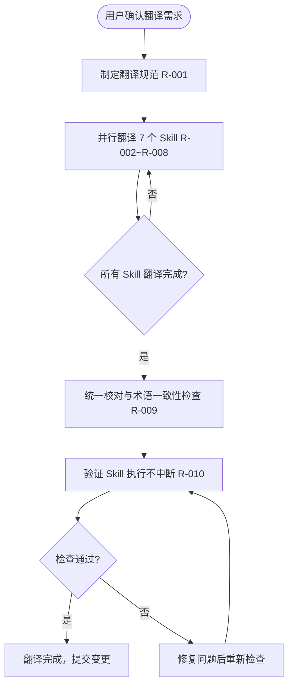

# 设计规格

> 生成时间: 2026-06-13
> 来源: /devflow — 方案蓝图阶段
> 基于: devflow/requirements.md

## 业务流程

## 范围与边界

### 在范围内
- `skills/clarify/_SKILL.md` 全文中文化
- `skills/breakdown/_SKILL.md` 全文中文化
- `skills/blueprint/_SKILL.md` 全文中文化
- `skills/discover/_SKILL.md` 全文中文化
- `skills/implement/_SKILL.md` 全文中文化
- `skills/verify/_SKILL.md` 全文中文化（路由关键词表保持中文）
- `skills/devflow/SKILL.md` 中仍为英文的部分中文化
- 建立统一术语对照表，确保跨 Skill 翻译一致

### 明确排除
- 不改 Skill 的 frontmatter 字段名（`name`、`description`、`argument-hint`、`allowed-tools`）
- 不改代码片段、命令行、工具名、文件路径、JSON 键名
- 不改 Playwright API 名称、CSS 属性、技术术语的英文原文
- 不调整 Skill 的执行逻辑、流程顺序、判断规则
- 不涉及 UI 布局检测增强（本次仅做中文化）

## 技术标准

- **语言规范**：自然语言描述使用简体中文；技术术语首次出现时提供中文，必要时保留英文原文或括号注释
- **格式规范**：保持原有 Markdown 结构（标题层级、列表、表格、代码块）不变
- **风格规范**： Skill 内对话模板/输出报告使用中文；状态标记统一为：通过/失败/待开始/进行中/已完成/未验证/已跳过
- **一致性规范**：同一英文术语在不同 Skill 中中文翻译保持一致

## 设计决策

| 决策 | 理由 | 考虑的替代方案 |
|------|------|---------------|
| 7 个 Skill 并行翻译 | 各 Skill 之间无依赖，可并行提高效率 | 串行翻译（慢，无必要） |
| 主体中文、术语保留英文 | 易读且不影响工具解析；代码和工具名改中文会破坏执行 | 全部中文化（会导致工具名和路径被改错） |
| verify 路由关键词表保持中文 | 现有 TC 和路由规则已经是中文，改动会破坏已有工作流 | 改为中英对照（增加复杂度，收益低） |
| 先定规范再翻译 | 避免各 Skill 翻译风格不一致，减少返工 | 边翻边定规范（容易出现术语不统一） |
| 人工校对 + 格式检查双保险 | 翻译错误影响模型理解；格式错误会破坏 Skill 解析 | 只翻译不检查（风险高） |

## 风险与缓解

| 风险 | 影响 | 缓解措施 |
|------|------|---------|
| 翻译时不小心改了 `allowed-tools` 或 frontmatter | Skill 无法被正确加载 | R-010 中明确检查 frontmatter 和工具名；编辑时只改自然语言 |
| 同一术语在不同 Skill 中翻译不一致 | 用户困惑，维护困难 | R-001 制定术语对照表；R-009 统一校对 |
| 中文表达过长导致表格或代码块变形 | Markdown 可读性下降 | 保持原有格式；长句换行但不破坏表格结构 |
| 翻译后模型对指令理解出现偏差 | Skill 执行效果下降 | R-010 验证关键指令段落；保留英文技术术语降低歧义 |
| 用户后续仍希望改回英文 | 回滚成本 | 所有修改通过 git 提交，可回退 |

## 关键术语中英对照表

| 英文术语 | 中文翻译 | 说明 |
|---------|---------|------|
| Smoke Scan | 烟雾扫描 | L1 层快速健康检查 |
| Interaction Verification | 交互验证 | L2 层真实用户操作验证 |
| Manual Verification | 手工验证 | L3 层人工判断验证 |
| Requirements Breakdown | 需求拆解 | Phase 2 |
| Solution Blueprint | 方案蓝图 | Phase 3 |
| Implementation | 编码实现 | Phase 4 |
| Verification | 测试验证 | Phase 5 |
| Clarification | 需求澄清 | Phase 1 |
| Discovery | 项目发现 | 可选入口 |
| Production-Grade | 生产级 | 强调非 demo 质量 |
| Acceptance Criteria | 验收标准 | R-xxx 的可衡量标准 |
| Test Case | 测试用例 | TC-xxx |
| Deep Scoring / Verification Depth | 验证深度 | 真正执行过的 TC 占比 |
| Evidence Coverage | 证据覆盖率 | 有证据的 TC 占比 |
| Rollback | 回退 | 发现问题后回退到前面阶段 |
| Handoff | 交接 | 阶段完成后的下一步提示 |

---

*由 DevFlow 追踪。请勿手动编辑。*
