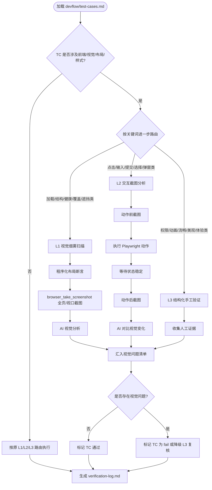

# 设计规格

> 生成时间: 2026-06-13
> 来源: /devflow — 方案蓝图阶段
> 基于: devflow/requirements.md
> Feature: verify-visual-ai-detection

## 业务流程

## 范围与边界

### 在范围内
- 扩展 `skills/verify/_SKILL.md`：
  - 新增 AI 视觉审查的目标、触发条件、执行步骤
  - 在 L1 增加“视觉烟雾扫描”子流程
  - 在 L2 增加“交互前后截图分析”子流程
  - 新增程序化布局断言规则与执行位置
  - 更新 TC 路由关键词表，让视觉/前端相关 TC 优先进入 L1/L2
  - 新增“视觉问题清单”章节及智能回滚路径
  - 在 `allowed-tools` 中补充 `browser_take_screenshot`
- 更新 `skills/blueprint/references/test-cases-template.md`：
  - 增加视觉相关 TC 示例（页面加载无遮挡、弹窗完整可见、响应式无重叠）
- 保持现有三层验证架构，仅增强其视觉检测能力

### 明确排除
- **不引入传统基线视觉回归**（如 Playwright `toHaveScreenshot` 或 pixel-diff 工具），本次以 AI 截图分析为主
- **不改动其他 Skill**（clarify / breakdown / blueprint / implement / discover）的自然语言或逻辑，仅更新 test-cases 模板
- **不修改 DevFlow 插件本身的 UI**或执行入口
- **不替代 L3**：权限、动画流畅度、主观审美仍由人工验证
- **不承诺捕获所有视觉缺陷**：重点覆盖“明显到人工一眼能看出”的重叠、遮挡、溢出、截断、错位、白块等问题

## 技术标准

- **语言规范**：Skill 自然语言描述使用简体中文；工具名、API 名、字段名、文件路径、代码片段保持英文
- **工具规范**：使用 Playwright MCP 的 `browser_take_screenshot` 进行截图；使用模型自身的 vision 能力分析截图
- **截图策略**：
  - L1 视觉烟雾扫描：默认全页截图（`fullPage: true`），关键页面可补充视口截图
  - L2 交互截图分析：动作前视口截图 + 动作后视口截图；若页面发生滚动或弹窗，补充 fullPage 截图
- **判定策略**：
  - 程序化断言优先执行，作为低成本过滤器
  - AI 视觉分析用于捕获规则难以描述的复杂视觉问题
  - 任何视觉问题均记录证据（截图文件路径或 base64）和严重程度
- **输出规范**：统一汇入 verification-log.md 的“视觉问题清单”，格式与现有 L1/L2/L3 报告一致

## 设计决策

| 决策 | 理由 | 考虑的替代方案 |
|------|------|---------------|
| 仅在 TC 涉及前端/视觉时启用 AI 截图分析 | 控制成本；纯后端/API 改动无需视觉验证 | 所有 TC 都截图分析（成本高、没必要） |
| 采用 AI 视觉分析而非传统基线对比 | 与用户现有 workflow 一致（截图发给 Claude 判断）；无需维护 baseline；能发现当前已存在的明显 bug | Playwright `toHaveScreenshot`（需要 baseline、对首次 bug 无效、维护成本高） |
| 程序化布局断言作为 AI 分析的补充 | 成本低、确定性高；减少不必要的 AI 调用 | 完全依赖 AI 视觉分析（成本高、有波动） |
| 视觉问题统一汇入 verification-log.md | 开发者可在一个地方看到所有前端展示问题，避免信息分散 | 分散在 L1/L2/L3 各自章节（难以整体评估视觉质量） |
| 视觉/前端 TC 优先路由到 L1/L2，而非 L3 | 减少人工验证负担，把明显问题尽量自动化 | 保留视觉类 TC 全部在 L3（现状，无法解决用户痛点） |
| 新增 `browser_take_screenshot` 到 allowed-tools | 这是实现截图分析的最小必要工具变更 | 同时增加大量视觉 MCP 工具（过度设计） |

## 风险与缓解

| 风险 | 影响 | 缓解措施 |
|------|------|---------|
| AI 视觉分析出现误报（把正常设计判为缺陷） | 验证结果不可靠，增加人工复核成本 | 设置严重程度分级；对“不确定”的结果降级到 L3 人工复核；提供标准化 prompt 模板 |
| AI 视觉分析漏报（明显问题没看出来） | 缺陷流入生产 | 用程序化断言兜底；prompt 中明确列出常见缺陷类型；保留 L3 作为最终防线 |
| 截图和 AI 调用增加验证耗时与成本 | 大型项目验证变慢 | 仅在 TC 涉及视觉时触发；程序化断言先过滤；关键页面才 fullPage 截图 |
| 修改 verify skill 时误改 frontmatter 或 allowed-tools | Skill 无法加载或执行中断 | R-008 专门验证 frontmatter 和工具名；编辑时只改自然语言与新增流程 |
| 不同模型 vision 能力差异导致判定不一致 | 跨环境验证结果不稳定 | prompt 中给出明确检查清单；结果以“发现/未发现 + 置信度”形式记录，避免二极管判定 |
| 用户项目没有可运行的前端应用 | 视觉检测步骤无法执行 | 保留原逻辑：无 baseURL 时降级到 L3 或跳过 |

## 关键术语中英对照表

| 英文术语 | 中文翻译 | 说明 |
|---------|---------|------|
| Visual Smoke Scan | 视觉烟雾扫描 | L1 中基于截图的初步视觉检查 |
| Interaction Screenshot Analysis | 交互截图分析 | L2 中动作前后截图对比分析 |
| Programmatic Layout Assertion | 程序化布局断言 | 基于元素几何信息的几何/样式规则检查 |
| Visual Issue Registry | 视觉问题清单 | verification-log.md 中汇总视觉问题的章节 |
| AI Visual Review | AI 视觉审查 | 由模型对截图进行视觉异常识别 |
| Overlap / Occlusion / Covering | 重叠 / 遮挡 / 覆盖 | 常见视觉缺陷类型 |
| Overflow / Truncation / Misalignment | 溢出 / 截断 / 错位 | 常见视觉缺陷类型 |

---

*由 DevFlow 追踪。请勿手动编辑。*
