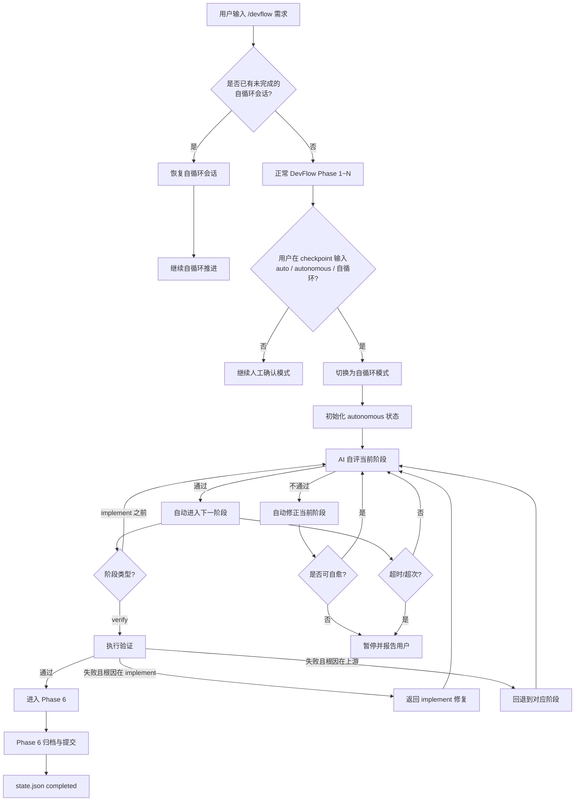
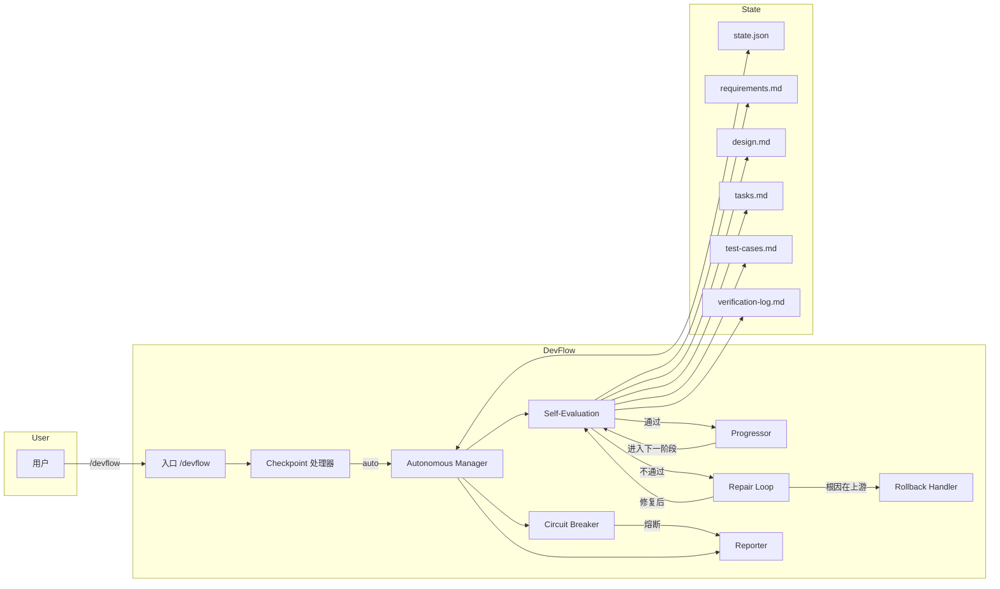

# 方案蓝图

> 生成时间: 2026-07-09
> 来源: /devflow — 方案蓝图阶段
> 对应需求: R-001 ~ R-010

## 1. 业务流程图



## 2. 规格边界

### 2.1 范围内

- 在现有 `/devflow` 单一入口内增加"自动确认/自循环"能力
- 支持从 clarify/breakdown/blueprint/implement/verify 任一 checkpoint 切入自循环
- AI 自评估 checklist 覆盖 clarify → completed 全阶段
- implement ↔ verify 自修复小循环
- 上游阶段（blueprint/breakdown/clarify）自动回退
- 超时与最大迭代熔断
- 关键节点/阻塞/安全边界时向用户报告
- 最终必须完成 Phase 6 的 commit + push

### 2.2 范围外

- 不新增 `/devflow auto` 等独立入口
- 不改写非 DevFlow 的 skill 或系统提示
- 不替代现有人工确认模式
- 不放宽 force push 等安全约束
- 不实现跨会话并行自循环

### 2.3 设计决策

| 决策 | 说明 |
|------|------|
| 触发方式 | 用户在 checkpoint 输入 `auto` / `autonomous` / `自循环` 等关键词，AI 切换模式 |
| 状态持久化 | `state.json` 新增 `autonomous` 对象，记录运行时与配置 |
| 自评方式 | 每阶段完成后运行该阶段 checklist，全部通过才算"确认" |
| 修复循环 | verify 失败优先返回 implement；连续 N 次修复同一问题未果则考虑上游回退 |
| 上游回退 | 由 AI 根据失败现象判断根因阶段，回退后更新 `rollback_history` |
| 熔断 | 默认 max_loops=20，timeout=4h；用户启动时可覆盖 |
| 报告策略 | 正常推进不打扰；异常/阻塞/完成时汇总报告 |

### 2.4 风险缓解

| 风险 | 缓解措施 |
|------|----------|
| 死循环 | max_loops + timeout + 连续同阶段失败检测 |
| 误回退 | 回退前必须写明根因推断，写入 `rollback_history` |
| 覆盖远端 | 保留 fast-forward 预检，禁止 force push |
| 用户不知情 | 启动时/恢复时输出自循环计划与退出条件；完成或熔断时汇总报告 |
| 状态损坏 | 每次阶段变化立即写 `state.json`，支持恢复 |

## 3. 技术架构图



## 4. 涉及文件

| 文件 | 动作 | 说明 |
|------|------|------|
| `skills/devflow/SKILL.md` | 修改 | 在主流程中加入自循环触发点、自评 checklist、修复循环、回退、熔断、报告规则 |
| `skills/devflow/_SKILL.md` | 修改 | 同步 SKILL.md 内容（项目约定） |
| `devflow/devflow-autonomous-loop/state.json` | 修改 | 运行时更新 `autonomous` 字段 |
| `devflow/devflow-autonomous-loop/design.md` | 新增 | 本文件 |
| `devflow/devflow-autonomous-loop/test-cases.md` | 新增 | 测试用例 |

## 5. 状态扩展设计

```json
{
  "autonomous": {
    "enabled": true,
    "status": "running",
    "started_at": "2026-07-09T12:55:00+08:00",
    "started_from": "clarify",
    "resume_phase": "implement",
    "current_loop": 3,
    "max_loops": 20,
    "timeout_at": "2026-07-09T16:55:00+08:00",
    "last_report_at": "2026-07-09T13:10:00+08:00",
    "repair_cycles": {
      "implement-verify": 2
    },
    "rollback_history": [
      {
        "from": "verify",
        "to": "blueprint",
        "reason": "TC-003 失败根因为设计规格遗漏权限边界",
        "at": "2026-07-09T13:05:00+08:00"
      }
    ]
  }
}
```

## 6. 自评 Checklist

### 6.1 Clarify
- [ ] 需求总结包含目标、包含项、排除项、成功标准、约束
- [ ] 无 open_questions
- [ ] 用户已确认（自循环起点必须是已确认状态）

### 6.2 Breakdown
- [ ] R-xxx 清单完整，编号连续
- [ ] 每条 R-xxx 含优先级、依赖、验收标准
- [ ] 无待澄清项

### 6.3 Blueprint
- [ ] design.md 包含流程图、规格边界、架构图、涉及文件
- [ ] test-cases.md 为每条 R-xxx 编写 TC-xxx
- [ ] TC 覆盖正常路径与异常路径

### 6.4 Implement
- [ ] T-xxx 全部完成
- [ ] tasks.md 已更新状态
- [ ] 代码已提交（至少一次 commit）
- [ ] 前置文档（requirements.md + design.md）足以指导实现

### 6.5 Verify
- [ ] verification-log.md 已生成
- [ ] L1/L2/L3 全部通过或已记录证据
- [ ] 深度评分 100%

### 6.6 Completed
- [ ] 工作区干净或已提交
- [ ] 合并验证通过（worktree/feat 模式）
- [ ] fast-forward 预检通过
- [ ] push 成功且远端一致
- [ ] state.json phase=completed

## 7. 报告模板

### 7.1 启动报告

```
🤖 已启用自循环模式
- 起始阶段: <phase>
- 目标: 完成整个 DevFlow 流程并提交推送
- 最大循环: <max_loops>
- 超时时间: <timeout_at>
- 常规推进将不打扰你，遇到阻塞或完成时汇总报告。
```

### 7.2 完成报告

```
✅ 自循环完成
- 结束阶段: completed
- 总循环: <current_loop>
- 最终提交: <commit-hash>
- 验证报告: devflow/<feature>/verification-log.md
```

### 7.3 熔断/阻塞报告

```
⏸️ 自循环已暂停
- 当前阶段: <phase>
- 原因: <timeout | max_loops | unrecoverable-block>
- 已尝试: <current_loop> 次
- 建议: <action>
```

---

*由 DevFlow 追踪。请勿手动编辑。*
