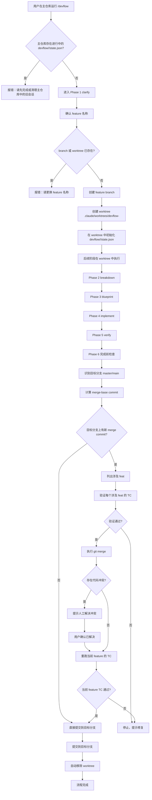

# 设计规格

> 生成时间: 2026-06-14
> 来源: /devflow — 方案蓝图阶段
> 基于: devflow/multi-worktree-sessions/requirements.md
> Feature: multi-worktree-sessions

## 业务流程

## 范围与边界

### 在范围内
- 主仓库运行 `/devflow` 时自动创建 worktree 和 feature 分支
- worktree 路径规范：`.claude/worktrees/devflow-<feature>`
- 目标分支自动识别：`master` 或 `main`
- 所有 DevFlow 文件按 feature 隔离在 `devflow/<feature>/` 下
- Phase 6 完成前的强制合并验证
- 时间窗口内涉及 feat 的测试用例重跑
- 合并冲突时强制人工解决，不允许自动覆盖
- 会话完成后自动清理 worktree
- 移除 `/devflow list` 和 `/devflow cleanup` 命令

### 明确排除
- 不支持跨 worktree 的会话自动恢复
- 不自动解决 git 合并冲突
- 不做通用语义冲突自动检测
- 不处理 node_modules、构建缓存等跨 worktree 共享资源
- 不支持 `master`/`main` 以外的目标分支
- 不使用 `rebase` 进行合并验证
- 不考虑旧版 `devflow/state.json` 的迁移

## 技术标准

- 项目结构：Claude/Codex plugin，核心逻辑为 `skills/devflow/SKILL.md`
- 版本号：从 v2.2 升级到 v2.3
- 命令规范：保持 `/devflow` 唯一入口
- Git 操作：使用标准 `git worktree`、`git merge-base`、`git merge`、`git log --merges`
- 状态管理：`devflow/<feature>/` 目录，随 feature 分支提交
- 输出语言：中文

## 设计决策

| 决策 | 理由 | 考虑的替代方案 |
|------|------|---------------|
| 使用 git worktree 隔离 | 用户需要代码修改隔离，且希望不手动切换分支 | 同一 worktree 内目录隔离（被否决，因为需要手动切换分支） |
| 所有 DevFlow 文件按 feature 放在 `devflow/<feature>/` | 状态与文档统一隔离，冲突验证时可读取其他 feat 的 test-cases.md | 状态文件放 .claude/（与文档分离，冲突验证时难以读取） |
| 强制 merge 验证 | 解决 v2.1 回退的 root cause：合并冲突缺少反馈 | 依赖用户自觉验证（已证明不可行） |
| 时间窗口内所有 merge commit 都验证 | 捕获语义冲突，而非仅代码冲突 | 只验证有文件冲突的 feat（会漏掉语义冲突） |
| 移除 list/cleanup 命令 | 保持单一入口，会话生命周期与 worktree 绑定 | 保留管理命令（用户认为不需要） |
| 只用 merge，不用 rebase | merge 对历史改写风险更低，冲突处理更直观 | rebase（会改写历史，风险更高） |

## 风险与缓解

| 风险 | 影响 | 缓解措施 |
|------|------|---------|
| 用户不习惯 worktree | 流程理解成本 | 自动创建 worktree，所有操作对用户透明，skill 文档明确说明 |
| worktree 目录冲突 | 同名 feature 无法创建 | 创建前检查 branch 和 worktree，冲突时明确提示换名 |
| 涉及 feat 验证成本过高 | 完成时间变长 | 只识别 merge commit，减少需要验证的范围 |
| worktree 清理失败 | 残留目录 | 清理前检查未提交变更，失败时给出明确提示 |
| 旧版 devflow/state.json 与新结构并存 | 目录结构混乱 | 新设计从 v2.3 开始采用 `devflow/<feature>/`，旧文件作为历史遗留保留 |

---

*由 DevFlow 追踪。请勿手动编辑。*
