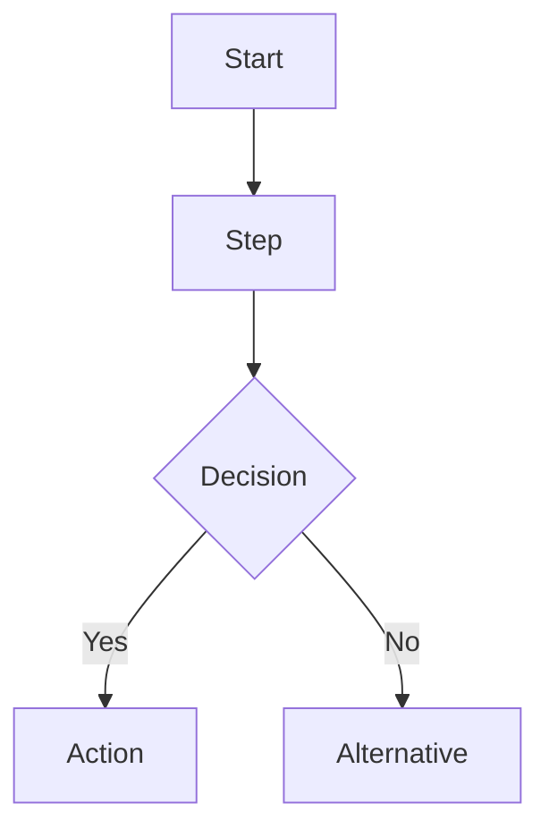

# DevFlow Plugin Implementation Plan

> **For agentic workers:** REQUIRED SUB-SKILL: Use superpowers:subagent-driven-development (recommended) or superpowers:executing-plans to implement this plan task-by-task. Steps use checkbox (`- [ ]`) syntax for tracking.

**Goal:** Build a Claude Code plugin (6 skills) that provides structured AI-assisted development workflow from project discovery through testing verification, with full-chain numbered tracking (R-xxx → T-xxx → TC-xxx).

**Architecture:** Pure markdown skills plugin — zero external dependencies. Each workflow phase is a user-invoked skill under the `devflow` namespace. Four persistent files (`devflow/*.md`) serve as cross-session state. Skills chain together via explicit handoff instructions at the end of each phase.

**Tech Stack:** Claude Code Plugin API (`.claude-plugin/plugin.json` + `skills/<name>/SKILL.md`), YAML frontmatter, Markdown

---

## File Structure

```
devflow/
├── .claude-plugin/
│   └── plugin.json
├── skills/
│   ├── discover/
│   │   └── SKILL.md
│   ├── clarify/
│   │   └── SKILL.md
│   ├── breakdown/
│   │   ├── SKILL.md
│   │   └── references/
│   │       └── requirements-template.md
│   ├── blueprint/
│   │   ├── SKILL.md
│   │   └── references/
│   │       ├── design-template.md
│   │       └── test-cases-template.md
│   ├── implement/
│   │   ├── SKILL.md
│   │   └── references/
│   │       └── tasks-template.md
│   └── verify/
│       └── SKILL.md
├── README.md
└── LICENSE
```

- `skills/<name>/SKILL.md` — Each command is a user-invoked skill with YAML frontmatter
- `skills/<name>/references/` — Template files and reference docs loaded on demand
- No `commands/` directory — using the newer `skills/<name>/SKILL.md` layout exclusively

---

### Task 1: Plugin Skeleton & Manifest

**Files:**
- Create: `devflow/.claude-plugin/plugin.json`
- Create: `devflow/LICENSE`
- Create: `devflow/README.md`

- [ ] **Step 1: Create plugin.json manifest**

```json
{
  "name": "devflow",
  "description": "Structured AI-assisted development workflow — from project discovery to verification. Six commands guide you through requirements, design, implementation, and testing with full-chain numbered tracking.",
  "author": {
    "name": "NumberTheEleven",
    "email": "numtheeleven@gmail.com"
  },
  "version": "1.0.0"
}
```

- [ ] **Step 2: Create LICENSE file**

MIT License content with copyright holder "NumberTheEleven".

- [ ] **Step 3: Create README.md**

```
# DevFlow

AI 开发规范流程插件 — 结构化 AI 辅助开发工作流。

## 安装

/plugin install devflow@eleven-marketplace

## 命令

| 命令 | 用途 |
|------|------|
| /devflow:discover | 项目探索 — 无需求时扫描优化机会 |
| /devflow:clarify | 需求澄清 — 模糊需求展开对齐 |
| /devflow:breakdown | 需求拆解 — 产出编号需求清单 |
| /devflow:blueprint | 方案蓝图 — 业务流程图+规格+测试用例 |
| /devflow:implement | 编码实现 — 任务拆解+架构图+Sub-agent |
| /devflow:verify | 测试验证 — 逐项核对，智能回退 |

## 工作流

discover → clarify → breakdown → blueprint → implement → verify

任意阶段可直接跳入。每阶段完成时自动询问下一步。
```

- [ ] **Step 4: Verify directory structure**

Run: `Get-ChildItem devflow -Recurse -Depth 2`
Expected: plugin.json, README.md, LICENSE all present.

---

### Task 2: /devflow:discover — Project Discovery

**Files:**
- Create: `devflow/skills/discover/SKILL.md`

- [ ] **Step 1: Write discover SKILL.md**

```markdown
---
name: discover
description: Scan the current project for optimization opportunities when you have no specific requirement in mind. Discover improvement areas in performance, architecture, maintainability, or feature gaps.
argument-hint: [project-path]
allowed-tools: [Read, Glob, Grep, Bash, TaskCreate]
---

# /devflow:discover — Project Discovery

## When to Use

You have NO specific requirement or task in mind. You want to find out what could be improved in the current project. This skill scans the codebase and generates a prioritized list of optimization opportunities.

**This skill is invoked directly by the user.** Do NOT auto-trigger.

## Process

### Step 1: Understand the Project

Read key project files to understand structure:
- `package.json` / `pyproject.toml` / `go.mod` / `Cargo.toml` / `build.gradle` (whichever exists)
- `README.md` or `CONTRIBUTING.md`
- Top-level directory structure

### Step 2: Scan for Opportunities

Run these analyses:

**Code Quality:**
- Find large files (>500 lines): `Get-ChildItem -Recurse -Include *.ts,*.js,*.py,*.go,*.rs,*.java | Where-Object { (Get-Content $_.FullName | Measure-Object -Line).Lines -gt 500 } | Select-Object FullName`
- Find files with high complexity (deep nesting, long functions)

**Architecture:**
- Identify circular dependencies or tightly coupled modules
- Check for missing separation of concerns (e.g., business logic in UI files)
- Look for duplicated code patterns across files

**Maintainability:**
- Missing tests: compare `src/` files against `test/` or `__tests__/` files
- Missing or outdated documentation
- TODO/FIXME/HACK comments: `rg "TODO|FIXME|HACK" --type-add 'code:*.{ts,js,py,go,rs,java}' -t code`
- Deprecated API usage

**Performance:**
- N+1 query patterns
- Missing caching layers
- Synchronous operations that could be parallelized

**Feature Gaps:**
- Missing error handling or edge case coverage
- Missing input validation
- Missing logging/observability

### Step 3: Generate Prioritized Report

Format the output as a structured report:

```markdown
## Project Optimization Opportunities

### Critical (P0)
- [ ] **[Category]** Description of issue. Affected files: `path/file.ts`. Suggested fix: ...

### High (P1)
- [ ] ...

### Medium (P2)
- [ ] ...

### Low (P3)
- [ ] ...
```

Each item must include:
- Priority (P0-P3)
- Category (Performance / Architecture / Maintainability / Feature Gap / Security)
- Clear description of the problem
- Specific file paths affected
- Concrete suggested approach to fix

### Step 4: Ask User to Choose

After presenting the report, ask the user to select one or more items to pursue. Then suggest:

> "Choose an item to work on. I recommend starting from the P0 items. Once selected, we'll use /devflow:clarify to expand on the requirement."

## Handoff

When the user selects an item, suggest:
- `/devflow:clarify` — to expand the selected optimization into a clear requirement

Do NOT automatically invoke clarify. Wait for the user to confirm.
```

- [ ] **Step 2: Verify the skill file exists and has valid YAML frontmatter**

Run: `Get-Content devflow/skills/discover/SKILL.md -Head 5`
Expected: Valid YAML frontmatter with `---` delimiters, `name: discover`, `description:`, `argument-hint:`, `allowed-tools:` fields.

---

### Task 3: /devflow:clarify — Requirements Clarification

**Files:**
- Create: `devflow/skills/clarify/SKILL.md`

- [ ] **Step 1: Write clarify SKILL.md**

```markdown
---
name: clarify
description: Expand and align on a vague requirement through structured dialogue. Explore user intent, constraints, and success criteria. Propose alternative approaches with trade-offs.
argument-hint: <rough-idea>
allowed-tools: [Read, Glob, Grep, Bash, WebSearch, TaskCreate]
---

# /devflow:clarify — Requirements Clarification

## When to Use

You have a rough idea or vague requirement. It might come from:
- A `/devflow:discover` optimization item you selected
- A feature idea you want to explore
- A problem statement that needs refinement

## Process

### Step 1: Restate the Idea

Restate what you understand in 1-2 sentences. Ask for confirmation before proceeding.

### Step 2: Explore Through Dialogue

Ask questions ONE AT A TIME. Each question should deepen understanding:

**Key dimensions to explore:**
- **Purpose:** What problem does this solve? Who benefits?
- **Constraints:** Any technical, time, or resource constraints?
- **Success criteria:** How will we know this is done and done well?
- **Scope:** What's in scope? What's explicitly NOT in scope?
- **Users:** Who are the end users? What's their workflow?
- **Existing code:** Any relevant parts of the codebase to be aware of?

**Dialogue rules:**
- One question per turn
- Prefer multiple choice when options are clear
- Open-ended is fine when exploring
- After 3-4 questions, summarize what you've learned and confirm

### Step 3: Propose 2-3 Approaches

Once the requirement is clear enough, propose 2-3 approaches:

```markdown
## Approaches

### Approach A: [Name]
**How:** [1-2 sentences]
**Pros:** ...
**Cons:** ...

### Approach B: [Name]
**How:** [1-2 sentences]
**Pros:** ...
**Cons:** ...

### Recommendation
[Which approach and why]
```

Lead with your recommended approach and explain why.

### Step 4: Converge to Clear Requirements

After the user selects an approach, produce a clear requirements summary:

```markdown
## Clarified Requirements

**Goal:** [One sentence]

**What:**
- Requirement 1
- Requirement 2
- ...

**What NOT to do:**
- Non-goal 1
- Non-goal 2

**Success Criteria:**
- Criterion 1
- Criterion 2

**Constraints:**
- Constraint 1
```

## Handoff

Once requirements are clear and user confirms, suggest:
- `/devflow:breakdown` — to break these requirements into a numbered, trackable checklist

Do NOT automatically invoke breakdown. Wait for the user to confirm.
```

- [ ] **Step 2: Verify the skill file exists and has valid YAML frontmatter**

---

### Task 4: /devflow:breakdown — Requirements Breakdown

**Files:**
- Create: `devflow/skills/breakdown/SKILL.md`
- Create: `devflow/skills/breakdown/references/requirements-template.md`

- [ ] **Step 1: Write requirements template**

```markdown
# Requirements Checklist

> Generated: YYYY-MM-DD
> Source: /devflow:breakdown

## R-001: [Title]

**Priority:** P0 / P1 / P2
**Status:** pending / in_progress / done
**Description:** [What needs to be done]
**Depends On:** [R-xxx or none]
**Acceptance Criteria:**
- [ ] [Measurable criterion]
- [ ] [Measurable criterion]

---

## R-002: [Title]
...

---
*Tracked by DevFlow. Do not edit manually.*
```

- [ ] **Step 2: Write breakdown SKILL.md**

```markdown
---
name: breakdown
description: Break down clear requirements into a numbered, trackable checklist. Each requirement gets an ID (R-001, R-002...), priority, dependencies, and acceptance criteria. Output is persisted to devflow/requirements.md.
argument-hint: [requirements-description]
allowed-tools: [Read, Write, Glob, Bash, TaskCreate]
---

# /devflow:breakdown — Requirements Breakdown

## When to Use

You have clear requirements — either from `/devflow:clarify` output, or you already have a well-defined PRD or requirements document. You can also start directly from this command if you already know what you want.

## Process

### Step 1: Load Existing State

Check if `devflow/requirements.md` exists. If it does, read it — we may be updating an existing breakdown.

### Step 2: Decompose Requirements

Break down the requirement into discrete, verifiable sub-requirements:

- Each sub-requirement = one numbered item (R-001, R-002, ...)
- Each gets a clear title and one-sentence description
- Assign priority: **P0** (must have), **P1** (should have), **P2** (nice to have)
- Mark dependencies: which other requirements must be completed first
- Each must have measurable acceptance criteria (checkbox format)

### Step 3: Present for Confirmation

Show the complete numbered list to the user:

```
## Requirements Checklist

R-001 | P0 | [Title] | depends: none
  Description: ...
  Accept: - [ ] criterion 1
          - [ ] criterion 2

R-002 | P1 | [Title] | depends: R-001
  ...
```

Ask user to confirm the breakdown, adjust priorities, or add/remove items.

### Step 4: Persist to File

Write to `devflow/requirements.md`:

- Create `devflow/` directory if it doesn't exist
- Use the template from `skills/breakdown/references/requirements-template.md`
- Fill in actual requirement data
- Set all statuses to `pending`

The file MUST follow the template format exactly — it will be read by downstream skills (`/devflow:blueprint`, `/devflow:verify`).

### Step 5: Confirm Persistence

Read back `devflow/requirements.md` to confirm it was written correctly. Show a summary to the user:

> "Requirements checklist saved to `devflow/requirements.md` with N items (R-001 to R-xxx)."

## Handoff

Ask the user:

> "Requirements locked. Next: /devflow:blueprint to create the solution design, business flow diagrams, and test cases. Or do you need to adjust anything?"

## Smart Rollback Awareness

If the user says anything like "requirement X is wrong" or "we need to change R-003":
- Update `devflow/requirements.md` with the change
- If any downstream files exist (`design.md`, `tasks.md`, `test-cases.md`), flag that affected items in those files may need re-validation
- Do NOT automatically modify downstream files — let the user re-run the relevant commands
```

- [ ] **Step 3: Verify both files exist**

---

### Task 5: /devflow:blueprint — Solution Blueprint

**Files:**
- Create: `devflow/skills/blueprint/SKILL.md`
- Create: `devflow/skills/blueprint/references/design-template.md`
- Create: `devflow/skills/blueprint/references/test-cases-template.md`

- [ ] **Step 1: Write design template**

```markdown
# Design Specification

> Generated: YYYY-MM-DD
> Source: /devflow:blueprint
> Based on: devflow/requirements.md

## Business Process Flow

[Flowchart description — use Mermaid syntax for renderability]



## Scope & Boundaries

### In Scope
- Item 1
- Item 2

### Out of Scope (Non-Goals)
- Explicitly excluded item 1
- Explicitly excluded item 2

## Technical Standards

- Coding standards: [Default AI conventions]
- Architecture constraints: [If any]
- Technology choices: [If applicable]
- Performance requirements: [If any]

## Design Decisions

| Decision | Rationale | Alternatives Considered |
|----------|-----------|------------------------|
| ... | ... | ... |

## Risks & Mitigations

| Risk | Impact | Mitigation |
|------|--------|------------|
| ... | ... | ... |

---
*Tracked by DevFlow. Do not edit manually.*
```

- [ ] **Step 2: Write test cases template**

```markdown
# Test Cases Checklist

> Generated: YYYY-MM-DD
> Source: /devflow:blueprint
> Linked Requirements: devflow/requirements.md

## TC-001: [Title]

**Status:** pending / in_progress / done
**Covers:** R-001 ([Requirement Title])
**Type:** unit / integration / e2e / manual
**Steps:**
1. [Setup step]
2. [Action step]
3. [Verification step]

**Expected Result:** [What should happen]

---

## TC-002: [Title]
...

---
*Tracked by DevFlow. Do not edit manually.*
```

- [ ] **Step 3: Write blueprint SKILL.md**

```markdown
---
name: blueprint
description: Create the solution blueprint from a requirements checklist. Produces business process flowcharts (Mermaid), spec boundaries with Non-Goals, and a numbered test case checklist (TC-001...).
argument-hint: [design-notes]
allowed-tools: [Read, Write, Glob, Bash, WebSearch, TaskCreate]
---

# /devflow:blueprint — Solution Blueprint

## When to Use

Requirements are locked in `devflow/requirements.md`. You need to create:
1. Business process flowchart (non-technical readable)
2. Specification boundaries and standards
3. Numbered test case checklist

You can also start here directly if you already have requirements and a design in mind.

## Process

### Step 1: Load Requirements

Read `devflow/requirements.md`. If it doesn't exist, ask the user to run `/devflow:breakdown` first, or describe the requirements now.

### Step 2: Business Process Flowchart (FIRST)

**Why first:** The business flow must be confirmed before defining specs. If the flow doesn't match user expectations, everything else is wasted.

Create a Mermaid flowchart describing the business process:

- Use user-facing language, not technical jargon
- Show actors, actions, decisions, and outcomes
- Keep it at a level non-technical stakeholders can understand
- Use swimlanes if multiple actors/roles are involved

Present the flowchart and ask:

> "Does this business flow match your understanding? Any steps missing or incorrect?"

Iterate until the user confirms.

### Step 3: Spec Boundaries & Standards (SECOND)

Based on the confirmed flowchart:

- **In Scope:** What this implementation covers
- **Out of Scope (Non-Goals):** What is explicitly excluded — equally important
- **Technical Standards:** Coding conventions, architecture constraints, technology choices
- **Design Decisions:** Key choices with rationale and alternatives considered
- **Risks & Mitigations:** What could go wrong and how to handle it

### Step 4: Test Case Checklist (THIRD)

For each requirement in `devflow/requirements.md`, define test cases:

- Each test case gets a unique ID (TC-001, TC-002, ...)
- Each maps back to a requirement ID (R-xxx)
- Type: unit / integration / e2e / manual
- Clear steps and expected results
- Status field for tracking during verification

### Step 5: Persist Both Files

Write `devflow/design.md` using the design template format.
Write `devflow/test-cases.md` using the test cases template format.

Verify both files were written correctly.

## Handoff

> "Blueprint complete. devflow/design.md and devflow/test-cases.md saved. Next: /devflow:implement to break down into development tasks and start coding."

## Smart Rollback Awareness

If user says the design or test cases need changes:
- Update the relevant file(s)
- If design changes affect downstream (tasks or code), flag for re-validation
- Suggest re-running `/devflow:implement` for affected tasks
```

- [ ] **Step 4: Verify all three files exist**

---

### Task 6: /devflow:implement — Implementation

**Files:**
- Create: `devflow/skills/implement/SKILL.md`
- Create: `devflow/skills/implement/references/tasks-template.md`

- [ ] **Step 1: Write tasks template**

```markdown
# Task Breakdown

> Generated: YYYY-MM-DD
> Source: /devflow:implement
> Based on: devflow/design.md, devflow/requirements.md

## T-001: [Title]

**Status:** pending / in_progress / done
**Covers:** R-001 ([Requirement Title])
**Dependencies:** [T-xxx or none]
**Complexity:** low / medium / high
**Estimated Files/Modules:**
- `path/to/module.ts` — [What to change]
- `path/to/another.ts` — [What to change]

**Description:** [What this task accomplishes]

---

## T-002: [Title]
...

---
*Tracked by DevFlow. Do not edit manually.*
```

- [ ] **Step 2: Write implement SKILL.md**

```markdown
---
name: implement
description: Execute implementation from the blueprint. First breaks down into numbered development tasks (T-001...), creates technical architecture diagrams (UML/swimlane/state machine), then dispatches parallel sub-agents for independent tasks and sequential TDD for dependent ones.
argument-hint: [implementation-notes]
allowed-tools: [Read, Write, Glob, Grep, Bash, Edit, Agent, TaskCreate, WebSearch]
---

# /devflow:implement — Implementation

## When to Use

The blueprint is ready (`devflow/design.md` and `devflow/test-cases.md` exist). You need to:
1. Break down into development tasks with file scoping
2. Create technical architecture documentation
3. Execute coding with sub-agents

You can also start here directly if you have an existing design.

## Process

### Step 1: Load Context

Read all existing DevFlow files:
- `devflow/requirements.md`
- `devflow/design.md`
- `devflow/test-cases.md`

If none exist, ask user for context or suggest starting from an earlier phase.

### Step 2: Task Breakdown (FIRST — Persist)

Break the blueprint into concrete development tasks:

- Each task gets ID: T-001, T-002, ...
- Each maps to requirement(s): R-xxx
- Identify dependencies between tasks
- Estimate complexity (low/medium/high)
- List likely files/modules affected
- Mark which tasks have NO dependencies (can be parallelized)

Present the task list. Ask user to confirm scope and file targeting.

Write to `devflow/tasks.md` using the template format.

### Step 3: Technical Architecture Documentation

Create appropriate technical diagrams in Mermaid format:

- **Data flow** → flowchart or data flow diagram
- **Multi-actor processes** → swimlane diagram
- **State changes** → state machine diagram
- **Entity relationships** → ER diagram
- **API design** → sequence diagram

Choose the diagram type(s) that best represent the technical design. Include in the architecture section of the conversation.

### Step 4: Execute Tasks

**Independent tasks (no dependencies):**
- Dispatch in parallel using sub-agents
- Each sub-agent gets: full task description, affected files, coding standards
- Each sub-agent follows TDD: write failing test → implement → verify → commit

**Dependent tasks (sequential dependencies):**
- Execute in dependency order
- Each task: TDD cycle → code review → commit
- Wait for dependencies to complete before starting

**Per-task quality gates:**
- TDD: test first, verify it fails, implement, verify it passes
- Code review: self-review the diff before committing
- Commit with descriptive message referencing T-xxx and R-xxx

### Step 5: Track Progress

Update `devflow/tasks.md` status fields as tasks complete:
- `pending` → `in_progress` → `done`

Report progress after each task.

## Handoff

After all tasks complete:

> "Implementation complete. All T-xxx tasks done. Next: /devflow:verify to run through the test case checklist and verify against requirements."

## Smart Rollback Awareness

- If user identifies an issue: determine if it's a task-level bug (re-run that task) or a design-level issue (suggest going back to `/devflow:blueprint`)
- If tasks.md needs updating: modify it and flag affected completed tasks for re-work
```

- [ ] **Step 3: Verify both files exist**

---

### Task 7: /devflow:verify — Verification

**Files:**
- Create: `devflow/skills/verify/SKILL.md`

- [ ] **Step 1: Write verify SKILL.md**

```markdown
---
name: verify
description: Verify implementation against the test case checklist (TC-xxx) and requirements (R-xxx). Runs through every item systematically. Failed items trigger smart rollback — AI identifies which phase to return to for fixes.
argument-hint: [verification-scope]
allowed-tools: [Read, Glob, Grep, Bash, Edit, TaskCreate]
---

# /devflow:verify — Verification

## When to Use

Implementation is complete. All development tasks in `devflow/tasks.md` are marked done. You need to systematically verify everything works as specified.

## Process

### Step 1: Load All Tracking Files

Read all DevFlow state files:
- `devflow/requirements.md` — what we promised to build
- `devflow/design.md` — the spec and scope
- `devflow/tasks.md` — what was implemented
- `devflow/test-cases.md` — the verification checklist

### Step 2: Verify Test Cases

Go through every test case in `devflow/test-cases.md`:

For each TC-xxx:
- Run the test if it's automated
- Manually verify if it's a manual test
- Mark status: `done` if passing, leave `pending` if not checked

For failed test cases:
- Identify which requirement (R-xxx) and task (T-xxx) it relates to
- Determine the root cause:
  - **Implementation bug** → suggest re-running the specific task in `/devflow:implement`
  - **Design issue** → suggest going back to `/devflow:blueprint` to fix the spec
  - **Requirement gap** → suggest going back to `/devflow:breakdown` or `/devflow:clarify`

### Step 3: Verify Requirements

Go through every requirement in `devflow/requirements.md`:

For each R-xxx:
- Does the implemented code actually satisfy the acceptance criteria?
- Is there test coverage (TC-xxx) that proves it works?
- Mark status: `done` if fully satisfied, leave as-is if not

### Step 4: Smart Rollback (When Issues Found)

When issues are found, classify them:

| User Feedback / Finding | Root Phase | Action |
|------------------------|------------|--------|
| "This requirement is wrong" | /clarify → /breakdown | Revisit requirements, update R-xxx |
| "The design doesn't handle X" | /blueprint | Fix spec, re-derive affected tasks |
| "This task has a bug" | /implement | Re-run specific T-xxx |
| "Test case is incorrect" | /blueprint | Update TC-xxx |

**Incremental redo principle:** Only re-do the affected chain. If R-003 changed and only T-005 and TC-008 were affected, only those need re-work. Everything else stays verified.

### Step 5: Generate Verification Report

```markdown
## DevFlow Verification Report

**Date:** YYYY-MM-DD

### Test Cases
- TC-001 ✅ | TC-002 ✅ | TC-003 ❌ (see below)
- Pass rate: X/Y (Z%)

### Requirements
- R-001 ✅ | R-002 ✅ | R-003 ✅
- Completion: X/Y (Z%)

### Issues Found
1. TC-003 failed: [description]
   - Root cause: [analysis]
   - Recommended action: /devflow:implement T-003
```

### Step 6: All Green — Complete

When everything passes:

> "All test cases pass. All requirements met. DevFlow cycle complete."

- All statuses in all files should be `done`
- Suggest next steps: commit, push, deploy, etc.
- The DevFlow cycle is now closed

## Handoff

After successful verification, the DevFlow cycle is complete. Suggest:
- Git commit and push
- PR creation if applicable
- No further DevFlow commands needed for this feature

If issues remain, the handoff is to the identified phase for re-work.
```

- [ ] **Step 2: Verify the skill file exists**

---

### Task 8: Marketplace Submission

**Files:**
- Modify: `C:\Users\A\.claude\plugins\marketplaces\eleven-marketplace\.claude-plugin\marketplace.json` — add devflow entry

- [ ] **Step 1: Add devflow to Eleven marketplace**

Add a new entry to the `plugins` array in `marketplace.json`. The plugin source needs to be a GitHub repo. First create the GitHub repo `NumberTheEleven/devflow`, push the plugin, then add:

```json
{
  "name": "devflow",
  "description": "Structured AI-assisted development workflow — from project discovery to verification with full-chain numbered tracking",
  "source": {
    "source": "github",
    "repo": "NumberTheEleven/devflow",
    "commit": "<latest-commit-sha>"
  }
}
```

- [ ] **Step 2: Verify marketplace.json is valid JSON**

Run: `Get-Content "C:\Users\A\.claude\plugins\marketplaces\eleven-marketplace\.claude-plugin\marketplace.json" | ConvertFrom-Json`
Expected: No parse errors.

- [ ] **Step 3: Create the GitHub repo**

Steps:
1. Create repo `NumberTheEleven/devflow` on GitHub
2. Push the `devflow/` directory as the repo root
3. Get the latest commit SHA
4. Update marketplace.json with the correct SHA

- [ ] **Step 4: Claude Code Marketplace submission (optional future step)**

For submission to the official Claude Code marketplace, follow the process at the official marketplace (PR-based submission).

---

### Task 9: Integration Test — End to End Workflow

- [ ] **Step 1: Test /devflow:discover**

In a fresh Claude Code session with the plugin installed:
```
User: /devflow:discover
```

Expected behaviors:
- AI scans the project
- Produces prioritized optimization report
- Offers to clarify a selected item

- [ ] **Step 2: Test full pipeline**

Using a sample project, run through the complete pipeline:
1. `/devflow:clarify "Add dark mode toggle"` → should produce clear requirements
2. `/devflow:breakdown` → should create `devflow/requirements.md` with R-001, R-002...
3. `/devflow:blueprint` → should create `devflow/design.md` and `devflow/test-cases.md`
4. `/devflow:implement` → should create `devflow/tasks.md` and produce code
5. `/devflow:verify` → should verify all TC-xxx and report results

- [ ] **Step 3: Test smart rollback**

During `/devflow:verify`, introduce a deliberate issue:
```
User: "Actually, R-001 is wrong. It should be a system toggle, not user toggle."
```

Expected: AI identifies this as a `/breakdown` phase issue, suggests updating requirements and re-running affected downstream phases.

- [ ] **Step 4: Test flexible entry**

Start a fresh session and jump directly to `/devflow:blueprint`:
```
User: /devflow:blueprint
       I already have requirements. Design the solution for adding a search bar.
```

Expected: AI asks for the requirements (since no `devflow/requirements.md`), then proceeds with blueprint creation.

---
