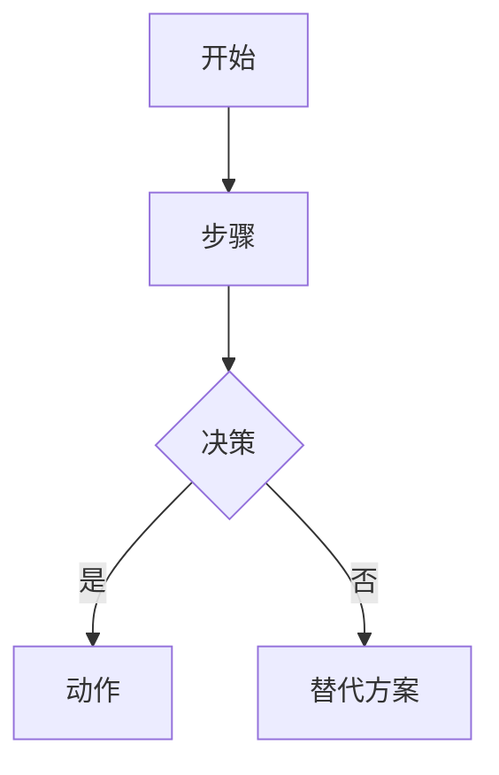

# 设计规格

> 生成时间: YYYY-MM-DD
> 来源: /devflow — 方案蓝图阶段
> 基于: devflow/requirements.md

## 业务流程

[流程图描述 — 使用 Mermaid 语法]

## 范围与边界

### 在范围内
- 项目 1
- 项目 2

### 明确排除
- 排除项 1
- 排除项 2

## 技术标准

- 编码规范: [默认 AI 约定]
- 架构约束: [如有]
- 技术选型: [如适用]
- 性能要求: [如有]

## 设计决策

| 决策 | 理由 | 考虑的替代方案 |
|------|------|---------------|
| ... | ... | ... |

## 风险与缓解

| 风险 | 影响 | 缓解措施 |
|------|------|---------|
| ... | ... | ... |

---

*由 DevFlow 追踪。请勿手动编辑。*
