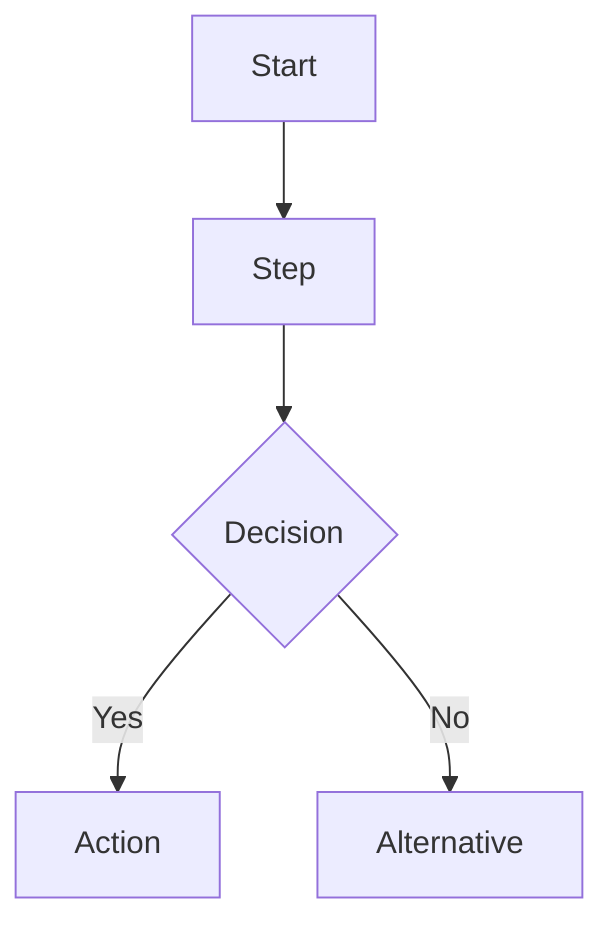

# Design Specification

> Generated: YYYY-MM-DD
> Source: /devflow:blueprint
> Based on: devflow/requirements.md

## Business Process Flow

[Flowchart description — use Mermaid syntax for renderability]

## Scope & Boundaries

### In Scope
- Item 1
- Item 2

### Out of Scope (Non-Goals)
- Explicitly excluded item 1
- Explicitly excluded item 2

## Technical Standards

- Coding standards: [Default AI conventions]
- Architecture constraints: [If any]
- Technology choices: [If applicable]
- Performance requirements: [If any]

## Design Decisions

| Decision | Rationale | Alternatives Considered |
|----------|-----------|------------------------|
| ... | ... | ... |

## Risks & Mitigations

| Risk | Impact | Mitigation |
|------|--------|------------|
| ... | ... | ... |

---
*Tracked by DevFlow. Do not edit manually.*
